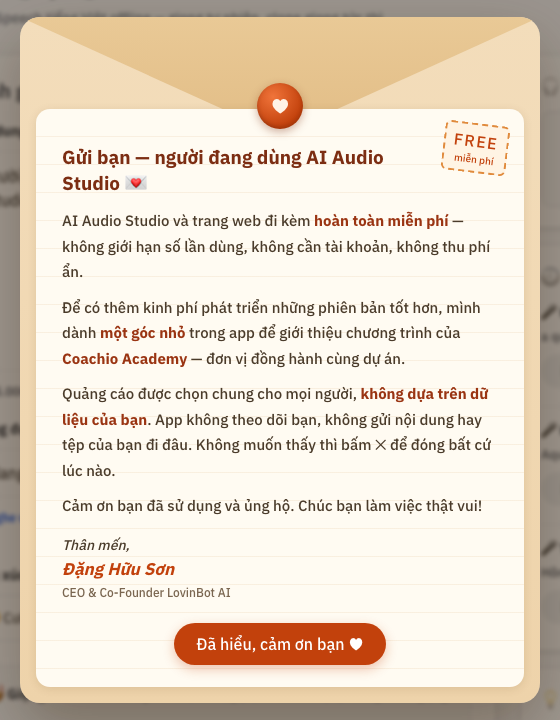

# 💌 Free App Kit — phát hành phần mềm miễn phí, có góc tài trợ

🌐 **Trang giới thiệu: https://app.danghuuson.com/free-app-sponsor-kit/**

Bộ **2 skill cho Claude Code** của Đặng Hữu Sơn, rút ra từ dự án thật [AI Audio Studio](https://github.com/sonlovinbot/vieneu-audio-studio):

| Skill | Dùng khi | Gồm |
|---|---|---|
| 🚀 **`free-app-ship`** | Vibe code xong một app, muốn **đẩy lên cho người dùng** hoặc **ra bản mới** | Hỏi đáp với người tạo (`SHIP.md`), **kiểm bảo mật trước khi share** (API key, token, lịch sử git, bản quyền, dữ liệu cá nhân trong ảnh/log), dọn repo, bộ cài zip + cài 1 lệnh (vượt Gatekeeper/SmartScreen), GitHub Releases, cập nhật phiên bản + changelog, README, trang GitHub Pages (video, ảnh, demo), giao diện + onboarding, **nhật ký bài học** |
| 💌 **`free-app-sponsor-kit`** | Cần **góc quảng cáo nhỏ** bù chi phí, **báo bản mới**, khung **"Phát triển bởi"** | Bộ code nhúng sẵn: thẻ Ad · Sponsor + thư ngỏ (i), thanh thông báo, UTM, lịch tự tắt — điều khiển từ xa bằng `news.json`. **Khung tài trợ cuối trang web** + **popup "Về game"** trong game 3D — điều khiển bằng `sponsors.json` |

---

## 💌 free-app-sponsor-kit

Gắn **"góc tài trợ"** vào phần mềm / website **miễn phí** bạn vibe code — minh bạch với người dùng,
điều khiển từ xa, không cần phát hành lại phần mềm.

<p>
  
  &nbsp;
  
</p>

## Có gì

- **Thẻ quảng cáo** nhãn `AD · SPONSOR` + nút **(i)** mở **thư ngỏ dạng phong bì**: phần mềm hoàn toàn miễn phí, một góc
  nhỏ quảng cáo giúp có kinh phí phát triển, quảng cáo không dựa trên dữ liệu người dùng.
- **Thanh thông báo** trên đầu trang (sự kiện, bảo trì) và **"Đã có bản mới"** tự sinh khi tăng `latest_version`.
- **Khung "Phát triển bởi"** dùng chung.
- **UTM tự động**: `utm_source` = app, `utm_medium` = `local_app` / `website`, `utm_campaign`, `utm_content` = vị trí + phiên bản.
- **Lịch tự tắt**: mọi quảng cáo bắt buộc có ngày kết thúc (theo giờ máy người dùng); xếp sẵn quảng cáo kế tiếp, đến ngày tự thay.
- **Một file `news.json` điều khiển tất cả** (GitHub Pages): app chạy local vẫn đổi được khi có mạng, mất mạng dùng bản đã lưu;
  website đọc thẳng. Một feed dùng chung nhiều app (lọc bằng `apps`).
- **An toàn**: chỉ nhận chữ + link https, không chạy mã từ xa, không theo dõi người dùng.

### Khung tài trợ cho website & game — `sponsors.json`

Một file quảng bá nhiều chương trình trên mọi trang: **khoá học Zoom, e-learning, workshop, cộng đồng Zalo**.

- **Tự xếp cái gần ngày lên đầu**: đang LIVE → còn hạn gần nhất → không thời hạn → đã hết (mờ, xuống cuối, **vẫn bấm được**).
- Còn ≤ 24 giờ: viền đỏ, nhãn **GẤP**, đếm ngược; ≤ 3 ngày: nhãn vàng. Sự kiện (`start`) và hạn ưu đãi (`deadline`) hiển thị khác nhau.
- **Trang nào hiện chương trình nào** khai trong `pages` — lưới thẻ (trang chủ), thẻ rộng thoáng (trang dự án), nền tối (trang game).
- **Trong game**: nhãn nhỏ "Về game" + popup dễ thương — tác giả, giới thiệu game, mời đăng ký chương trình còn hạn đầu tiên.
  Không tự bật, không che HUD (ẩn khi đang chơi / đè đúng chỗ chip có sẵn), popup mở thì game không nhận phím.
- UTM đủ 4 tham số theo trang + vị trí; trang có Meta Pixel thì gửi thêm `SponsorClick`.
- `scripts/validate_sponsors.py --urls` kiểm giờ có múi giờ, link https mở được, ảnh có thật.

## 🚀 free-app-ship — quy trình phát hành

Nói với Claude: *"chuẩn bị phát hành app này"* · *"ra bản mới 1.2"* · *"check security trước khi share"* · *"làm trang giới thiệu"*.

| Bước | Việc | Công cụ |
|---|---|---|
| 1 | Hỏi người tạo những gì chưa suy ra được, ghi `SHIP.md` | `references/02-hoi-dap-nguoi-tao.md` |
| 2 | Dọn repo: bỏ thứ người dùng không cần, giữ LICENSE + ghi nhận | `references/01-quy-trinh-tong.md` |
| 3 | **Kiểm bảo mật** — 0 ĐỎ mới được push công khai | `scripts/preship_check.sh` |
| 4 | Bộ cài + cài 1 lệnh + GitHub Release | `templates/install-online.*`, `build-installers.sh` |
| 5 | README + trang Pages (video nhúng, ảnh từ bản sạch, tải trực tiếp, sự cố) | `references/05-…`, `examples/build_pages_…py` |
| 6 | Giao diện, onboarding, tương phản, khổ màn hình | `references/06-giao-dien-ux.md` |
| 7 | Báo bản mới, quảng cáo, kiểm link sau phát hành | `free-app-sponsor-kit`, `scripts/verify_release.sh` |

`references/07-bai-hoc.md` ghi lại **mọi lỗi đã gặp và phản hồi của người tạo** (có ngày) — Claude đọc trước mỗi bước để không lặp lại.

```bash
bash skills/free-app-ship/scripts/preship_check.sh .     # 🔴 ĐỎ / 🟡 VÀNG / 🟢 OK — exit 1 nếu còn ĐỎ
bash skills/free-app-ship/scripts/verify_release.sh <user>/<repo> <App>
```

## Cài vào Claude Code

```
/plugin marketplace add sonlovinbot/free-app-sponsor-kit
/plugin install free-app-sponsor-kit@sonlovinbot-skills   # cài cả 2 skill
```

Hoặc chép tay 2 thư mục trong `skills/` vào `~/.claude/skills/`.

## Dùng

Khi đang làm một phần mềm miễn phí, chỉ cần nói với Claude:

> *"Gắn sponsor kit vào app này"* · *"thêm góc quảng cáo Coachio và khung phát triển bởi"* · *"làm giống AI Audio Studio"*

Claude sẽ chép bộ code, đặt vị trí, nối feed, gắn UTM và chạy bộ kiểm tra (giả lập đồng hồ ngày hết hạn, thử mục độc,
dọn cache thử). Chi tiết quy trình: [`skills/free-app-sponsor-kit/SKILL.md`](skills/free-app-sponsor-kit/SKILL.md).

| Thư mục | Nội dung |
|---|---|
| `kit/` | `sponsor-kit.js` + `sponsor-kit.css` — không phụ thuộc thư viện |
| `web/` | `sponsors.js` + `sponsors.css` — khung tài trợ website + popup trong game (`sponsors.json`) |
| `server/` | Proxy `/api/news` cho FastAPI và Express (cache đĩa khi offline) |
| `templates/` | `news.json`, `sponsors.json` mẫu, hướng dẫn đăng thông báo, chỗ để ảnh quảng cáo |
| `scripts/validate_news.py` | Kiểm feed trước khi push (`--urls` mở thử link và ảnh) |
| `examples/integrate.html` | Đoạn gắn mẫu |

Bản chạy thật: [AI Audio Studio](https://app.danghuuson.com/vieneu-audio-studio/) · các dự án khác: [app.danghuuson.com](https://app.danghuuson.com) — giọng nói AI tiếng Việt chạy trên máy tính.

---
Phát triển bởi **[Đặng Hữu Sơn](https://www.facebook.com/danghuuson.182/)** — CEO & Co-Founder LovinBot AI · MIT License
